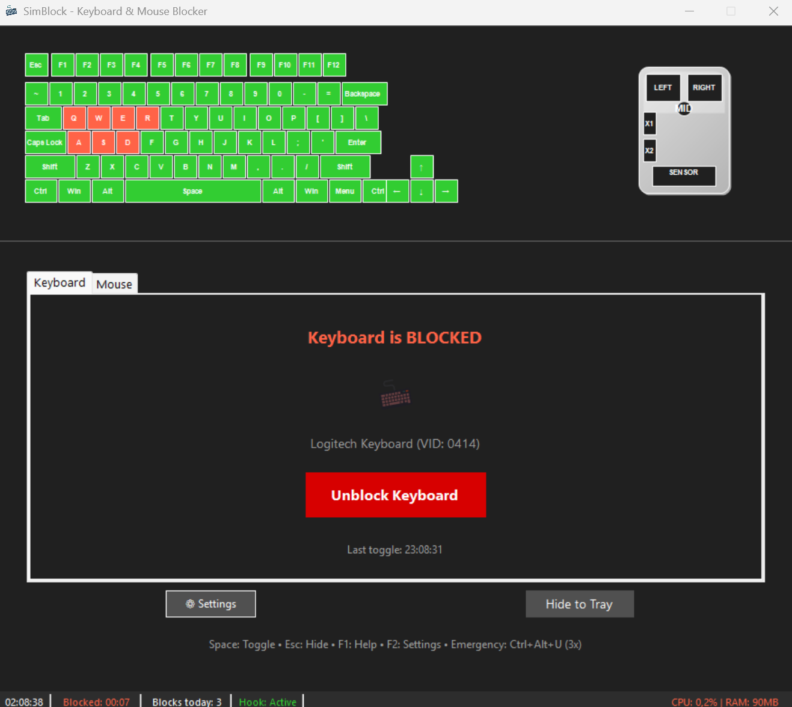

# SimBlock - Simple Keyboard Blocker

A very lightweight Windows application that allows you to temporarily block all keyboard input globally with a single toggle button, designed to safely clean your keyboard.

## Features

-  **One-Click Toggle** - Simple button to block/unblock keyboard input
-  **Global Keyboard Blocking** - Blocks all keyboard input system-wide
-  **Emergency Unlock** - Ctrl+Alt+U combination to unlock in case of issues
-  **System Tray Integration** - Minimize to tray and toggle from tray icon
-  **Clean Architecture** - Layered design with dependency injection
-  **Windows Native** - Uses Win32 API for reliable keyboard hooking

## Screenshots

<div align="center">
  
  <p><i>Main player interface with library and playlists</i></p>
  
  
  <p><i>Widget inside the application tray</i></p>
</div>

## Emergency Unlock

If the application becomes unresponsive or you need to quickly unlock:
- Press **Ctrl+Alt+U** **three times in quick succession** (within 2 seconds) to immediately unlock the keyboard
- This works even when the keyboard is globally blocked
- The triple-press requirement prevents accidental unlocks

## Architecture

The application follows Clean Architecture principles:

```
src/
├── Core/
│   ├── Domain/          # Business entities and interfaces
│   └── Application/     # Application services and use cases
├── Infrastructure/      # Platform-specific implementations
│   └── Windows/         # Windows API integration
└── Presentation/        # UI layer (WinForms)
    ├── Forms/           # Windows Forms
    └── ViewModels/      # View models
```

## Technologies Used

- **.NET 8** - Target framework
- **Windows Forms** - GUI framework
- **Microsoft.Extensions.Hosting** - Dependency injection and configuration
- **Win32 API** - Low-level keyboard hooking


## Building and Running

1. **Prerequisites:**
   - Windows 10/11
   - .NET 8 SDK

2. **Build:**
   ```powershell
   dotnet build
   ```

3. **Run:**
   ```powershell
   dotnet run
   ```

## Usage

1. Launch the application
2. Click "Block Keyboard" to prevent all keyboard input
3. Clean your keyboard safely
4. Click "Unblock Keyboard" or use the emergency combination (Ctrl+Alt+U)
5. Minimize to system tray for easy access

## Security Note

This application requires administrative privileges to install global keyboard hooks. It only blocks keyboard input locally and does not transmit any data. You are welcome to inspect the source code. 
```

## Contributing
Contributions are welcome! Please open an issue or submit a pull request for any enhancements or bug fixes.

## License
This project is licensed under the MIT License - see the [LICENSE](LICENSE) file for details.