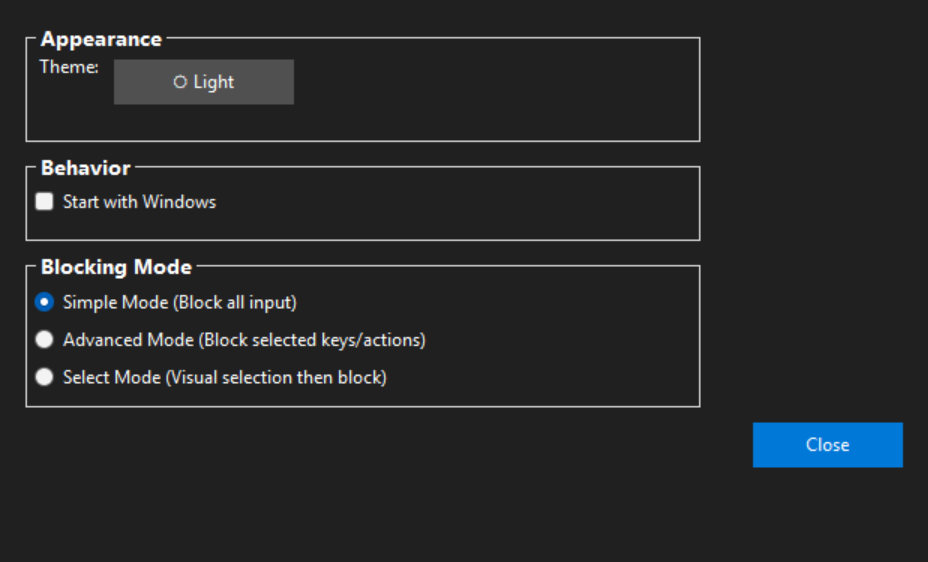
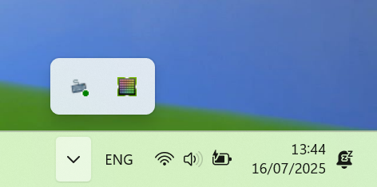

<div align="left">
    
    <br><br>
</div>

# Simblock - Simple Input Blocker

A lightweight Windows application that allows you to temporarily block all keyboard 
and mouse input globally with a single toggle button, designed to safely clean your peripherals.

## Features

-  **One-Click Toggle** - Simple button to block/unblock keyboard / mouse input
-  **Global Blocking** - Blocks all input system-wide
-  **Emergency Unlock** - **Ctrl + Alt + U** to revert the block state in case of issues
-  **System Tray Integration** - Minimize to tray and toggle from tray icon
-  **Windows Native** - Uses Win32 API for reliable keyboard and mouse hooking
-  **Keyboard Layouts** - Switch between US and Turkish Q layouts in Settings

## Screenshots

<div align="center">
  
  <p><i>Main interface</i></p>
  
   
   <p><i>User configurable settings</i></p>

   
   <p><i>Advanced blocking mode</i></p>

   
   <p><i>Manual selection blocking mode</i></p>
   
   
   <p><i>Minimized to tray</i></p>

</div>

## Emergency Unlock

If you've blocked your mouse or need to quickly unlock:
- Press **Ctrl+Alt+U** **three times in quick succession** (within 2 seconds) to immediately unlock the input. 
- The triple-press requirement is to prevent accidental unlocks.

## Architecture

The application follows Clean Architecture principles:

```
src/
├── Core/
│   ├── Domain/          # Business entities and interfaces
│   └── Application/     # Application services and use cases
├── Infrastructure/      # Platform-specific implementations
│   └── Windows/         # Windows API integration
└── Presentation/        # UI layer (WinForms)
    ├── Forms/           # Windows Forms
    └── ViewModels/      # View models
```

## Technologies Used

- **.NET 8** - Target framework
- **Windows Forms** - GUI framework
- **Microsoft.Extensions.Hosting** - Dependency injection and configuration
- **Win32 API** - Low-level keyboard hooking


## Building and Running

1. **Prerequisites:**
   - Windows 10/11
   - .NET 8 SDK

2. **Build:**
   ```powershell
   dotnet build
   ```

3. **Run:**
   ```powershell
   dotnet run
   ```

## Usage

1. Launch the application
2. Configure the blocking mode via the settings menu.
3. Go to the designated **Mouse** or **Keyboard** tab in the main interface.
4. Click "Block Keyboard" or "Block Mouse" toggle buttons to prevent all peripheral input
5. Click the toggle button again or use the emergency combination to unlock input.
6. Minimize to system tray for easy access, click on the icon to toggle state

### Keyboard Layouts

- **Switch layout**: Open `Settings` → `Appearance` → `Keyboard layout` and choose `US` or `TurkishQ`.
- The keyboard visualization in Select mode will update labels accordingly (e.g., `Ğ Ü Ş İ Ö Ç` on Turkish Q).

## Global Hook Installation

During the initial startup, Simblock registers low-level system hooks using the Windows [`SetWindowsHookEx`](src/Infrastructure/Windows/WindowsKeyboardHookService.cs) API with `WH_KEYBOARD_LL` and `WH_MOUSE_LL` parameters. This process establishes a global message filter that intercepts all keyboard and mouse events system-wide before they reach target applications.

**Expected Behavior During Initialization:**
- **Hook Registration Phase**: The application installs hooks into the Windows message chain, which may cause brief input latency (2-5 seconds)
- **Message Loop Integration**: Simblock integrates with the Windows message pump to process input events in real-time
- **Performance Impact**: Temporary cursor stuttering or input delays may occur as the system adjusts to the new hook procedures

**Technical Details:**
- Hooks operate at kernel-level with high priority message processing
- Input events are intercepted, evaluated, and either passed through or suppressed based on blocking state
- The application uses optimized message handling and performance overhead is minimized after initialization

Future releases will implement lazy hook loading and improved message processing algorithms to reduce initialization impact.

## Security Note

This application requires administrative privileges to install global keyboard hooks. It only blocks keyboard input locally and does not transmit any data. You are welcome to inspect the source code.

